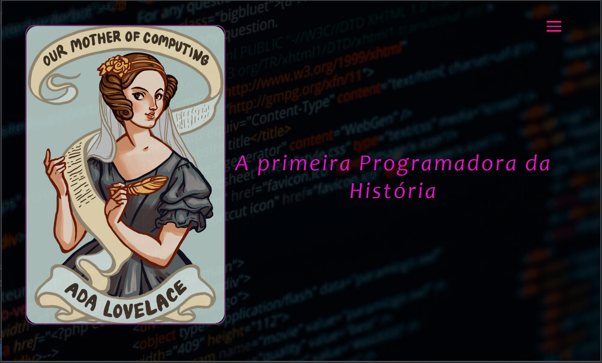
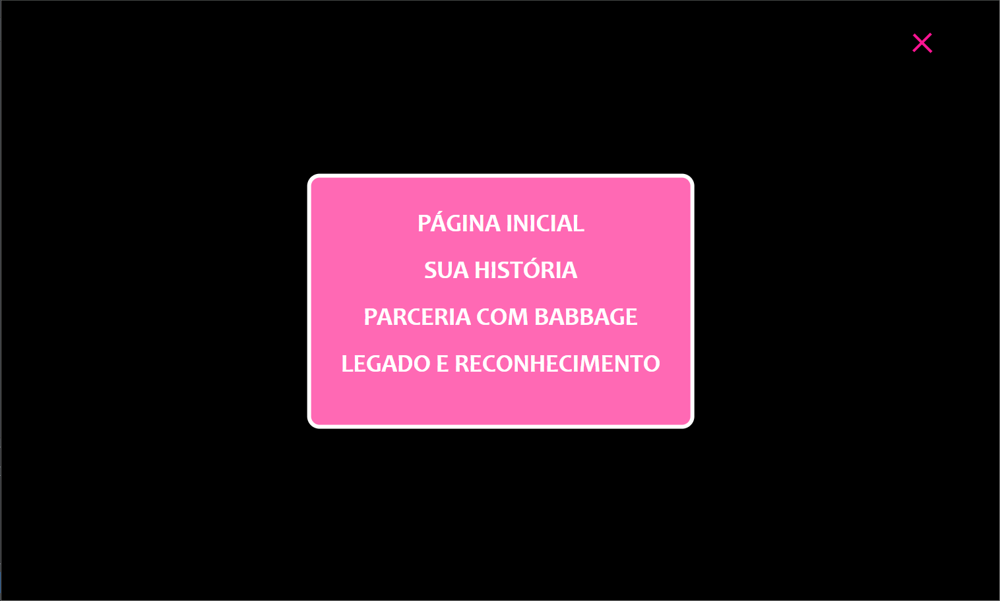
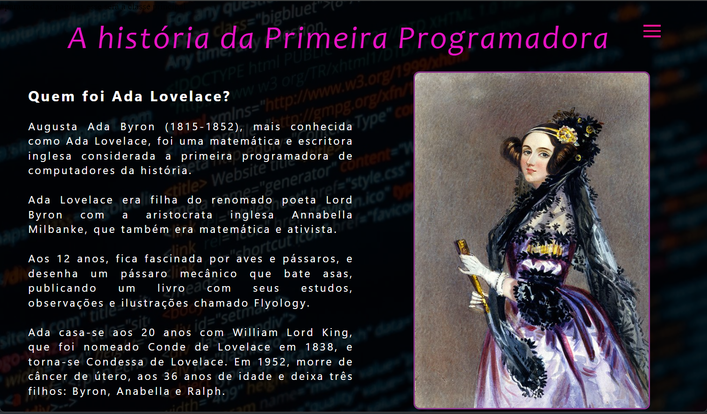
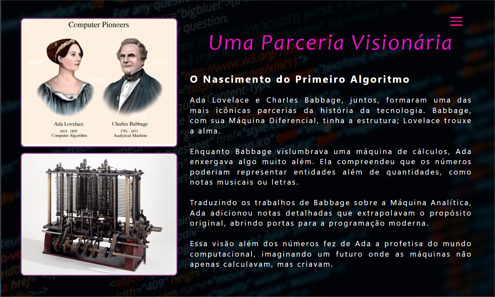

# Projeto Meu Primeiro Blog

Este é o meu primeiro projeto de blog, criado como parte do meu aprendizado em tecnologias web. Utilizando HTM, CSS, JS e Bootstrap para a estrutura e estilização, 
desenvolvi um blog dedicado a contar a história de Ada Lovelace, proporcionando uma aplicação prática das ferramentas e conceitos que venho estudando.

# Tema do Blog: Ada Lovelace
O blog é dedicado a Ada Lovelace, uma das figuras mais importantes na história da computação. O conteúdo do blog foca nos seguintes tópicos:

* História de Ada Lovelace: Uma visão geral de sua vida e realizações.
* Parceria com Charles Babbage: Como Ada colaborou com Babbage no desenvolvimento da "Máquina Analítica" e escreveu o primeiro algoritmo para ser processado por uma máquina.
* Legado e Reconhecimento: O impacto de Ada Lovelace na história da computação e como seu trabalho é celebrado até hoje.

# Tecnologias Utilizadas

* HTML5
* CSS3
* JavaScript
* Bootstrap

